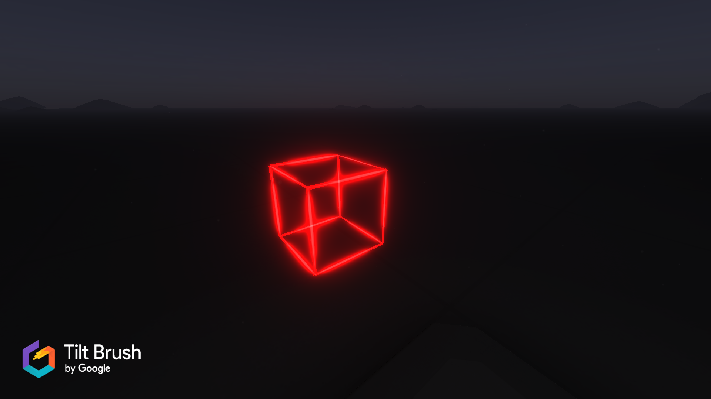

# Tilt brush editor

[Tilt brush documentation](https://docs.google.com/document/d/11ZsHozYn9FnWG7y3s3WAyKIACfbfwb4PbaS8cZ_xjvo/preview)

Inspired by reddit user /u/DrewFitz: [Tilt brush reverse engineering](https://www.reddit.com/r/Vive/comments/4f7q7f/tilt_brush_save_file_reverseengineering_update/). The comment from /u/1pid was also very helpful.

A .tilt file is an uncompressed .zip file with an additional header. The zip contains the following files: A thumbnail PNG, the brush stroke data in a custom binary format (data.sketch), and a JSON metadata file.

The tool can generate a new .tilt file from a json template. Only stroke color, brush size and point position is supported currently. For some reason, the generated tilt file does not behave as expected if two adjacent points in a stroke are too far from each other. For this reason, the generator will add extra points so that the maximum distance between two points is `0.5`.

Wireframes can be created from .stl files.

